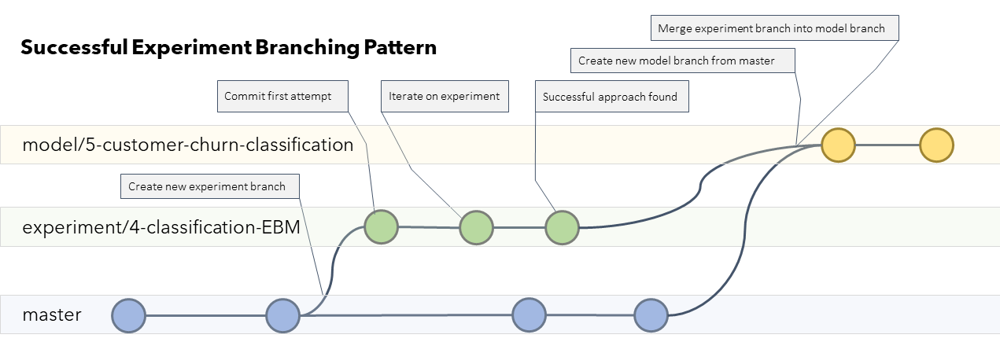
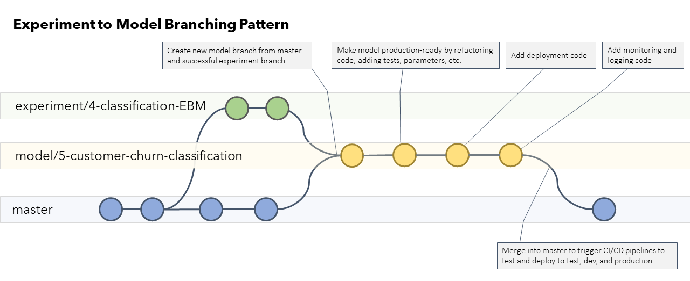

# Branch Types

As part of the Data Science Lifecycle Process we introduce some new branching strategies that reflect the flow of a typical data science project. In practice, there are key differences between Data Science and Software Engineering. Most notably, Data Science work requires a lot of experimentation and prototyping and doesn't have a clear linear path forward. Typical branching strategies struggle to accommodate the fact that:

1.  A large portion of the code you write is throw-away; it's value lies in the knowledge gained rather than the functionality itself. 
2. It's often difficult to know in advance what done looks like
3. While we don't want to merge all of our code to master, we don't want to throw it away either.
   
Rather than reinventing the wheel, we adapted existing branching strategies to the needs of the data science lifecyle. For most of the code we write, we'll be able to use standard Feature/Issue branching strategies. For the rest, we created some new branch types and workflows for using them.

See Also: [Example diagrams of branching patterns](./branching-patterns.pdf)

## Branch Types
- [Branch Types](#branch-types)
  - [Branch Types](#branch-types-1)
  - [Collaboration Branches](#collaboration-branches)
    - [Master](#master)
    - [Development (Optional)](#development-optional)
  - [Feature and Issue Branches](#feature-and-issue-branches)
    - [Naming Convention](#naming-convention)
      - [Examples](#examples)
  - [Data Branches](#data-branches)
    - [Naming Convention](#naming-convention-1)
      - [Examples](#examples-1)
    - [PR Target](#pr-target)
    - [Diagram](#diagram)
    - [Best Practices](#best-practices)
  - [Explore Branches](#explore-branches)
    - [Naming Convention](#naming-convention-2)
      - [Examples](#examples-2)
    - [PR Target](#pr-target-1)
    - [Best Practices](#best-practices-1)
  - [Experiment Branches](#experiment-branches)
    - [Naming Convention](#naming-convention-3)
      - [Examples](#examples-3)
    - [PR Target](#pr-target-2)
      - [Failed Experiments](#failed-experiments)
        - [Diagram](#diagram-1)
      - [Successful Experiments](#successful-experiments)
        - [Diagram](#diagram-2)
    - [Best Practices](#best-practices-2)
      - [Create New Feature Branches for Resuable Components](#create-new-feature-branches-for-resuable-components)
  - [Model Branches](#model-branches)
    - [Naming Convention](#naming-convention-4)
      - [Examples](#examples-4)
    - [PR Target](#pr-target-3)
    - [Diagram](#diagram-3)
    - [Best Practices](#best-practices-3)
  

## Collaboration Branches

Your collaboration branch(es) is (are) the primary branch(es) for your repository. They will be the target for your Pull Requests and the code in them will be what you ultimately ship.

### Master

The Master branch is the primary collaboration branch. It is the source of truth for your repo. Everything in master should be shippable.

### Development (Optional)

Many teams opt to have another collaboration branch called development. Whether you use this is up to your team. If you opt for a development branch, then development should be the target of your pull requests for all features instead of master.

You will then merge development to master per your team's workflow.

## Feature and Issue Branches

Anything not explicitly covered by the custom branch types below should follow standard software development lifecyle best practices (e.g. GitHub Flow).

Create a branch for each issue or feature you want to add and merge it to your collaboration branch when it's ready.

### Naming Convention

>[issue-number]-descriptive-branch-name

#### Examples
> [issue-number]-calculate-cltv  
> [issue-number]-custom-risk-scoring-function  
> [issue-number]-docs/data-gotchas-and-caveats

## Data Branches

Use this branch type for writing data ingestion pipelines for known datasets or for creating new datasets. Commits that include documentation related to the datasets or data pipelines should also happen on this branch. Once the data pipelines are finalized you can merge this into your collaboration branch.

### Naming Convention

> data/[issue-number]-dataset-name  

#### Examples
> data/[issue-number]-customer-purchase-history  
> data/[issue-number]-product-prediction-data  
> data/[issue-number]-customer-reviews-text-corpus

### PR Target

The PR's for your data pipelines should target your collaboration branch.

### Diagram

### Best Practices

- Once your pipeline code has been merged to master, use an orchestration and scheduling tool to run the pipelines on your data. 
  - Register a new version your dataset after each merge to your collaboration branch
  - Set your input and output directories using parameters so that you can easily change them depending on where you deploy (test, dev, prod, etc.)
- Include schema definition files, data dictionaries, and othe data documentation as part of the Pull Request when merging these branches. Data is less useful without documentation.
- Write data validation tests, schema checks, and sanity checks instead of manually reviewing the datasets. This ensures that when the data is updated or changed, you can be more confident that things are still correct.

## Explore Branches

Use this branch type to collaborate and share your exploration as you go.

### Naming Convention

> explore/[issue-number]-description-of-exploration

#### Examples

> explore/[issue-number]-customer-sales-data  
> explore/[issue-number]-customers-multiple-accounts  
> explore/[issue-number]-call-transcripts

### PR Target

None. 

Because exploration is experimental and temporary in nature, we never merge it to our collaboration branch. If you create something useful you want to merge to your collaboration branch, create a new feature branch for it (see best practices).

### Best Practices

- Don't merge your exploration to master or you'll flood your repo. By creating PR's for these branches, you'll ensure that your work is saved for posterity. 

> It's very important to label your PR's and link them to relevant issues so that you can find them later after you've closed them.

- If you create something useful, create another feature branch where you convert your exploration code into docs, widgets, code snippets, etc. 

> You don't want to check code in that's temporary in nature. If it has lasting value take the time to convert it to real code.

- Have a goal in mind when you start exploring. It's very easy to fall down rabbit holes. If you can't come up with a goal, timebox your exploration and summarize whatever you find at the end.

## Experiment Branches

Use this branch type for working on and collaborating on experiments. Because you'll often build lots of models and features that don't work, you don't want to commit everything to your collaboration branch. 

### Naming Convention

> experiment/[issue-number]-experiment-description  

#### Examples
> experiment/[issue-number]-sales-forecasts-baseline  
> experiment/[issue-number]-sales-forecasts-automl  
> experiment/[issue-number]-sales-forecasts-custom-loss

### PR Target

#### Failed Experiments

If an experiment doesn't pan out, mark the Experiment issue as failed with a label, close the PR without merging and update the Experiment issue with a TLDR explaining what you tried and how it turned out. Link to your experiment tracking tool so that others can view the runs.

##### Diagram

)

#### Successful Experiments

If an experiment is successful and you want to start the deployment process:

1. Update the experiment issue with a TLDR and mark as successful using a label.
1. Open a Model Issue to prepare the model and pipelines for production.
2. Create a "Model" branch using Master as the base.
3. Merge upstream changes from Master into your experiment branch and resolve any conflicts.
4. Change the target of the Experiment PR to the Model branch.
5. Merge the pull request to your Model branch and close the Experiment Issue.
6. Delete the experiment branch after merging the PR.

##### Diagram

### Best Practices

- Don't forget to commit your code before submitting your run so that you can log a clean commit in the experiment run!
- Make sure you track your experiments in an ML logging tool so you can see what you've tried. 

####  Create New Feature Branches for Resuable Components

As you experiment, you'll often create useful components that can be used in other places. In this case, you should create a new feature branch for integrating the useful code into the collaboration branch so that others can use it. Some examples might include:

- Creating a useful feature for your models
- Creating a custom scoring metric
- Creating a utility function that helps you perform a task.

## Model Branches

Use this branch to turn your successful experiments into deployable models. This is similar to an integration branch. In this branch you'll make sure your model runs from end to end. 

Use this branch to:

- Refactor and parametrize your model code
- Train your model against the full dataset and capture the results
- Register and deploy your model
- Run tests against your models
- Create deployment and retraining pipelines.
- Add additional logging and monitoring
- Do a final review and approval before deploying.

### Naming Convention

> model/[issue-number]-descriptive-model-name

#### Examples

> model/[issue-number]-forecast-customer-sales-baseline  
> model/[issue-number]-forecast-customer-sales-ensemble
> model/[issue-number]-classify-customer-transcripts

### PR Target

Once your model is ready to go, you should merge to your collaboration branch. From there you can use your CD process to deploy your model.

### Diagram

### Best Practices

The model branches are where your code needs to get hardened and ready for production.

- Use MLOps to automate portions of this process
- Create a post-deployment strategy including metrics to monitor and a retraining schedule
- Have your data science team and devops teams collaborate to make sure things go smoothly
- Make a plan for rolling back your model if the performance doesn't meet expectations
